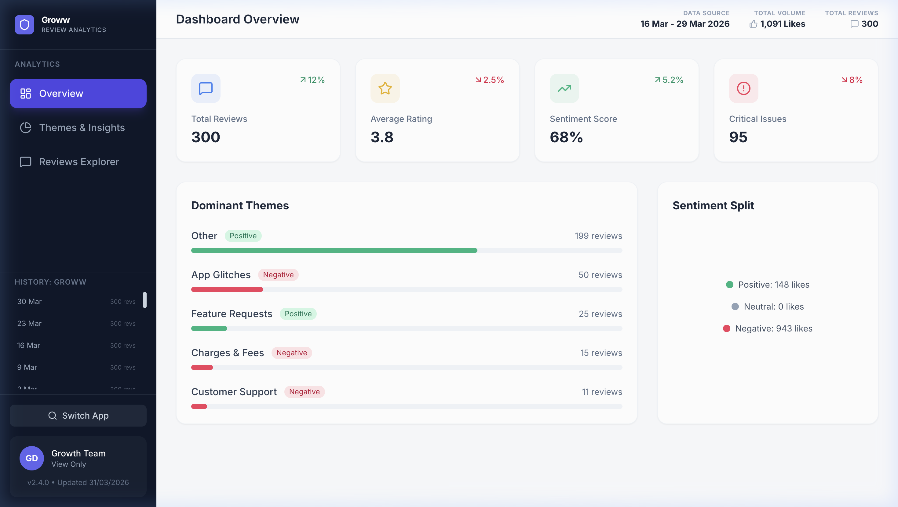
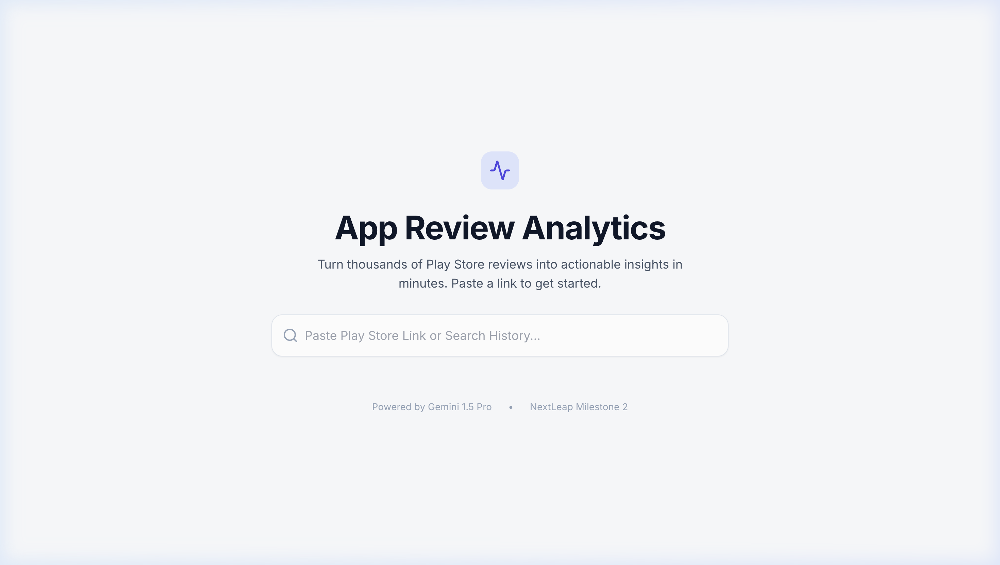
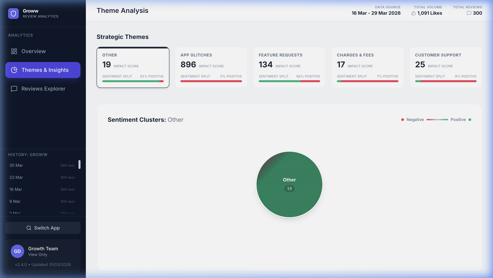

<div align="center">

# 📊 App Review Insights Analyzer

### _From noise to signal — in one pipeline._

**Turn thousands of Play Store reviews into a weekly leadership briefing, powered by Gemini AI.**

[](https://100cr.cloud/reviews/)
[](https://github.com/Atman-Deshmane/App-Review-Analytics/actions)
[](https://ai.google.dev/)

---



<br/>

*Real dashboard output — 300 reviews analyzed, 5 themes extracted, sentiment mapped. All automated.*

</div>

---

## 💡 The Problem

Product teams drown in app reviews. Thousands of them. Every week.

Most review dashboards show you **stars and counts**. But what leadership actually needs is:

> *"What are users frustrated about this week? What should we fix next? Show me the quotes."*

Manually reading 300+ reviews, grouping them into themes, picking quotes, and writing a report takes **hours**. And it's the kind of work nobody wants to do every Monday morning.

**This project does it in ~4 minutes. Fully automated. Zero human intervention.**

---

## 🎯 What It Does

One pipeline. Five stages. Complete automation.

```
Paste a Play Store link
       ↓
  Fetch 300 reviews (ranked by helpfulness)
       ↓
  AI identifies 5 strategic themes
       ↓
  Every review gets classified + sentiment-tagged
       ↓
  Weekly pulse report + email + live dashboard
```

**The output is a one-page leadership briefing** with:
- 📌 Top 3 themes with impact scores
- 💬 3 real user quotes that tell the story
- ⚡ 3 specific, actionable recommendations
- 📧 Delivered to your inbox. Every Monday. Automatically.

---

## 🖥️ Live Demo

> **🌐 [https://100cr.cloud/reviews/](https://100cr.cloud/reviews/)**

Paste any Play Store app link → Configure → Watch the AI work in real-time → Get your dashboard.

<div align="center">

| Home — Paste & Analyze | Themes & Sentiment Clusters |
|:---:|:---:|
|  |  |

</div>

---

## 🏗️ Architecture

This isn't a notebook. It's a **production-grade pipeline** with CI/CD, real-time status tracking, and automated deployment.

```
                        ┌──────────────────────────────────┐
                        │     GitHub Actions (CI/CD)       │
                        │  Schedule: Weekly | On-Demand    │
                        └──────────────┬───────────────────┘
                                       │
                        ┌──────────────▼───────────────────┐
                        │        orchestrator.py            │
                        │  Pipeline coordinator + status    │
                        │  tracking via Firebase RTDB       │
                        └──────────────┬───────────────────┘
                                       │
              ┌────────────────────────┼────────────────────────┐
              │                        │                        │
   ┌──────────▼──────────┐  ┌─────────▼──────────┐  ┌─────────▼──────────┐
   │   fetch_reviews.py  │  │ core_analysis_v2.py│  │  generate_manifest │
   │                     │  │                     │  │       .py          │
   │ • Scan & Filter     │  │ • Gemini 2.5 Flash  │  │ • Version control  │
   │ • Sort by helpful-  │→ │ • Theme discovery   │→ │ • History tracking │
   │   ness (thumbs up)  │  │ • Sentiment tagging │  │ • Manifest.json    │
   │ • Date-range filter │  │ • Deep-dive tags    │  │                    │
   │ • App metadata      │  │ • Report generation │  │                    │
   └─────────────────────┘  └─────────────────────┘  └────────────────────┘
                                       │
              ┌────────────────────────┼────────────────────────┐
              │                        │                        │
   ┌──────────▼──────────┐  ┌─────────▼──────────┐  ┌─────────▼──────────┐
   │  Email Notification │  │  Archive to History │  │  FTP Deploy to     │
   │  (HTML + Markdown)  │  │  (Versioned folders)│  │  Hostinger         │
   │  + Dashboard Link   │  │  + Git commit/push  │  │  (Live Dashboard)  │
   └─────────────────────┘  └─────────────────────┘  └────────────────────┘
```

### How It's Different

| Feature | Typical Approach | This Project |
|:---|:---|:---|
| **Review Selection** | Latest reviews (often low-effort/fake) | **Most helpful** — sorted by thumbs-up count |
| **Theme Detection** | Manual categories | **AI-discovered** — Gemini identifies themes from content |
| **Execution** | Manual notebook run | **Fully automated** — GitHub Actions on schedule |
| **Output** | CSV dump | **Executive-ready briefing** + interactive dashboard |
| **Deployment** | None | **Live at [100cr.cloud/reviews](https://100cr.cloud/reviews/)** with FTP CI/CD |
| **Status Tracking** | None | **Real-time** via Firebase Realtime Database |

---

## 📧 Sample Email Report

The system generates and emails a formatted weekly pulse. Here's a real output:

```
Subject: Weekly Pulse: Groww Review Insights

──────────────────────────────────────────────

## Weekly App Review Pulse: Groww Leadership Briefing
Reporting Period: Nov 20 to Nov 26

### Executive Summary
User demand for sophisticated data visualization (Total Asset View,
GIFT Nifty) is driving the majority of actionable sentiment friction.
Core trading execution reliability faces persistent scrutiny.

### Top Themes (Ranked by User Impact)

| Theme                                    | Impact Score | Top Quote Votes |
|:-----------------------------------------|:-------------|:----------------|
| Platform Features, UX & Data Viz         | 21,708       | 9,652           |
| Account, Onboarding & Fund Management    | 9,644        | 3,572           |
| Trading & Investment Execution           | 6,804        | 874             |
| Customer Support & Transparency          | 3,947        | 819             |
| Mutual Funds & Long-Term Wealth          | 2,413        | 1,180           |

### Recommended Actions
1. Accelerate "Total Asset Value" dashboard view
2. Audit real-time trading data feeds for latency
3. Leverage MF automation success in marketing campaigns

──────────────────────────────────────────────

                [ Open Interactive Dashboard → ]
```

---

## 🧠 AI Analysis — Under the Hood

The analysis pipeline uses **Google Gemini 2.5 Flash** across 4 sequential AI stages:

### Stage 1: Strategic Theme Discovery
```
Input: 300 review texts (ranked by helpfulness)
Prompt: "Categorize into 5 high-level, plain-English buckets"
Output: ["App Glitches", "Feature Requests", "Charges & Fees", "Customer Support", "Other"]
```
> **Design decision:** We enforce plain English labels ("Login Issues", not "Authentication Friction") to keep reports accessible to non-technical leadership.

### Stage 2: Global Classification
Every review gets mapped to one theme + one sentiment (Positive/Negative).
The full review corpus is sent as context — so the AI classifies with **global awareness**, not review-by-review.

### Stage 3: Deep-Dive Tagging
For each theme, a separate AI call generates **3-6 granular sub-tags** (e.g., under "App Glitches" → "App Crash", "Slow Loading", "OTP Failure"). Every review gets mapped to a tag — this powers the dashboard's drill-down.

### Stage 4: Report Generation
All aggregated data (theme stats, impact scores, top quotes) is fed to Gemini to write a concise leadership briefing with executive summary, quotes, and recommendations.

> **Rate limit handling:** All AI calls use exponential backoff (30s → 60s → 120s) with up to 5 retries. Token usage is logged per call.

---

## 🛠️ Tech Stack

| Layer | Technology | Purpose |
|:------|:-----------|:--------|
| **AI Engine** | Google Gemini 2.5 Flash | Theme extraction, classification, report writing |
| **Data Collection** | `google-play-scraper` | Play Store review fetching with pagination |
| **Data Processing** | `pandas` | Filtering, ranking, merging |
| **Dashboard** | React 18 + TypeScript + Tailwind CSS | Interactive visualization |
| **Build** | Vite | Fast bundling for production |
| **Animations** | Framer Motion | Smooth UI transitions |
| **CI/CD** | GitHub Actions | Automated weekly runs + on-demand triggers |
| **Status Tracking** | Firebase Realtime Database | Live progress updates to frontend |
| **Hosting** | Hostinger (FTP deploy) | Production dashboard at 100cr.cloud |
| **Email** | SMTP (Gmail) | Formatted HTML report delivery |

---

## 🚀 Quick Start

### Prerequisites
- Python 3.11+
- Node.js 18+ (for dashboard)
- [Gemini API Key](https://ai.google.dev/)

### 1. Clone & Install

```bash
git clone https://github.com/Atman-Deshmane/App-Review-Analytics.git
cd App-Review-Analytics

# Python backend
pip install -r requirements.txt

# Dashboard frontend
cd dashboard && npm install && cd ..
```

### 2. Configure Environment

Create `.env` in the root:

```env
# Required
GEMINI_API_KEY_NEXTLEAP=your_gemini_api_key

# Email (optional — for report delivery)
EMAIL_SENDER=your_email@gmail.com
EMAIL_PASSWORD=your_app_password
EMAIL_RECIPIENT=recipient@example.com

# Firebase (optional — for real-time status tracking)
FIREBASE_SERVICE_ACCOUNT={"type":"service_account",...}
FIREBASE_DB_URL=https://your-project.firebaseio.com
```

### 3. Run the Pipeline

```bash
python orchestrator.py \
  --app_id com.nextbillion.groww \
  --count 200 \
  --themes "auto" \
  --email you@example.com
```

**Parameters:**
| Flag | Default | Description |
|:-----|:--------|:------------|
| `--app_id` | `com.nextbillion.groww` | Play Store package ID |
| `--count` | `200` | Number of reviews to fetch |
| `--themes` | `auto` | `auto` for AI detection, or comma-separated list |
| `--email` | — | Recipient for the report email |
| `--start_date` | 2 weeks ago | `YYYY-MM-DD` format |
| `--end_date` | Today | `YYYY-MM-DD` format |
| `--job_id` | — | Firebase job ID for status tracking |

### 4. Run the Dashboard Locally

```bash
cd dashboard
npm run dev
# → Open http://localhost:5173/reviews/
```

---

## 🔄 Automated Weekly Runs (GitHub Actions)

The pipeline runs automatically every **Monday at 9:00 AM IST** via GitHub Actions.

**Manual trigger:**
1. Go to [Actions → Weekly App Review Pulse](https://github.com/Atman-Deshmane/App-Review-Analytics/actions)
2. Click **"Run workflow"**
3. Configure: app ID, review count, email, date range
4. The pipeline fetches → analyzes → archives → deploys → emails

**What happens automatically:**
```
GitHub Actions triggers → orchestrator.py runs
  → Reviews fetched and analyzed
  → Results archived to history/ (versioned: 2026-03-30_300reviews)
  → Git commit + push (history data)
  → Dashboard rebuilt and deployed via FTP
  → Email sent with report + dashboard link
```

### GitHub Secrets Required

| Secret | Purpose |
|:-------|:--------|
| `GEMINI_API_KEY_NEXTLEAP` | Gemini AI access |
| `EMAIL_SENDER` / `EMAIL_PASSWORD` / `EMAIL_RECIPIENT` | Report delivery |
| `FIREBASE_SERVICE_ACCOUNT` / `FIREBASE_DB_URL` | Real-time status |
| `FTP_SERVER` / `FTP_USERNAME` / `FTP_PASSWORD` | Dashboard deployment |
| `VITE_FIREBASE_*` | Dashboard Firebase config |
| `VITE_GITHUB_TOKEN` / `VITE_GITHUB_OWNER` / `VITE_GITHUB_REPO` | Dashboard data fetch |

---

## 📊 Dashboard Features

### Overview
- **KPI Cards** — Total reviews, average rating, sentiment score, critical issues count
- **Dominant Themes** — Bar visualization with sentiment indicators
- **Sentiment Split** — Positive/Neutral/Negative by community voice (likes)

### Themes & Insights
- **Strategic Theme Cards** — Impact score + sentiment split per theme
- **Sentiment Cluster Bubbles** — Interactive bubbles sized by volume, colored by sentiment gradient (red↔green)
- **Topic Inspector** — Click any bubble to see matching user verbatim in a slide-out panel

### Review Explorer
- Full review table with search, filter by theme/tag/sentiment/rating
- Rating badge, date, thumbs-up count, app version

### History & Versioning
- **Sidebar version selector** — Browse past analysis runs (e.g., "30 Mar • 300 revs")
- **URL-based navigation** — `?app=com.nextbillion.groww&version=2026-03-30_300reviews`
- **Multi-app support** — 23 apps analyzed and counting

---

## 📂 Project Structure

```
App-Review-Analytics/
├── orchestrator.py              # Pipeline coordinator
├── fetch_reviews.py             # Play Store scraper (Scan & Filter)
├── core_analysis_v2.py          # Gemini AI analysis engine
├── generate_manifest.py         # Version manifest generator
├── requirements.txt             # Python dependencies
│
├── dashboard/                   # React + TypeScript frontend
│   ├── App.tsx                  # Main app (Router + Dashboard)
│   ├── pages/Home.tsx           # Landing page (search + config)
│   ├── components/
│   │   ├── ConfigModal.tsx      # Analysis configuration UI
│   │   ├── TerminalLoader.tsx   # Real-time progress terminal
│   │   ├── BubbleViz.tsx        # Sentiment cluster visualization
│   │   ├── ReviewDrawer.tsx     # Side panel review inspector
│   │   └── ThemeCard.tsx        # Theme summary card
│   ├── utils/
│   │   ├── firebase.ts          # Firebase RTDB subscription
│   │   ├── githubApi.ts         # GitHub Actions dispatch
│   │   └── dataProcessing.ts   # Review data transformation
│   └── public/history/          # Archived analysis results
│       ├── com.nextbillion.groww/
│       ├── com.meesho.supply/
│       └── ... (23 apps)
│
├── utils/
│   └── send_notification.py     # Decoupled email sender
│
├── .github/workflows/
│   ├── weekly_pulse.yml         # Main CI/CD pipeline
│   └── deploy.yml               # Dashboard-only deploy
│
├── history/                     # Legacy analysis archive
├── email_draft.txt              # Sample email output
└── assets/                      # README screenshots
```

---

## ⚠️ Known Limitations

- **Rate Limits** — Gemini API has per-minute quotas; the pipeline uses exponential backoff but may stall on free-tier keys with large review counts
- **Review Language** — Optimized for English reviews; non-English reviews may reduce theme accuracy
- **Date Precision** — Play Store doesn't expose exact timestamps; dates are approximate
- **Review Freshness** — Sorting by "Most Relevant" biases toward established, high-engagement reviews over very recent ones (this is intentional — see design rationale below)

### 🎯 Design Rationale: Why "Most Helpful" Over "Newest"

Most review analysis tools sort by newest. We deliberately don't:

1. **Newest reviews are often low-effort** — "good app 👍" or "bad app 👎" with no actionable content
2. **Many newest reviews may be fake/incentivized** — especially for popular apps
3. **"Most Helpful" reviews are community-vetted** — high thumbs-up count means real users agree
4. **Coverage is still recent** — most helpful reviews from the last 12 weeks overlap heavily with recent reviews
5. **Impact scoring uses thumbs-up** — a review with 5,000 likes represents 5,000+ users' sentiment, not just one

---

## 🤝 Built For

This project was built as **Milestone 2** of the [NextLeap AI Bootcamp](https://www.nextleap.app/), demonstrating:

| Skill Area | What's Demonstrated |
|:-----------|:-------------------|
| **LLMs & Prompting** | Multi-stage Gemini prompting: theme discovery → classification → tagging → report writing |
| **Summarization** | Condensing 300 reviews into a 250-word executive briefing |
| **AI Workflow Automation** | End-to-end pipeline: Import → Group → Generate Note → Draft Email |
| **Production Engineering** | CI/CD, Firebase RTDB, FTP deployment, version control |

---

## 👨‍💻 Author

**Atman Deshmane**

[](https://github.com/Atman-Deshmane)

---

<div align="center">

### ⭐ If this helped you, consider starring the repo!

**🌐 [Live Dashboard](https://100cr.cloud/reviews/)** · **📧 [Weekly reports, automated](https://github.com/Atman-Deshmane/App-Review-Analytics/actions)** · **🤖 Powered by Gemini AI**

</div>
